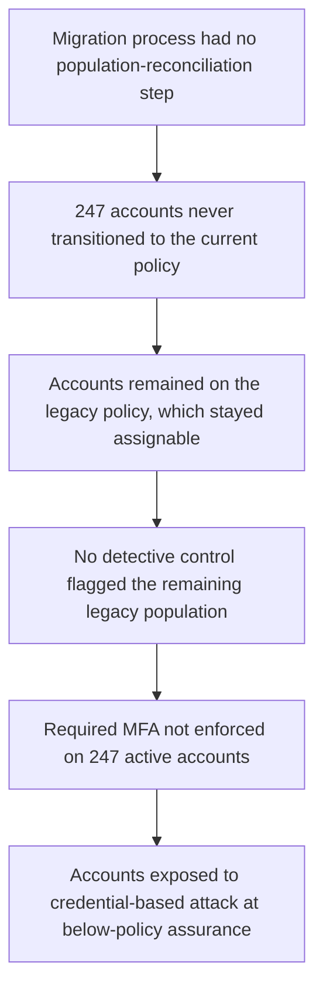

# Root Cause Analysis — Finding F-01

## Reasoning chain

The diagram summarizes the chain; each link's evidence classification (PROVED / SUPPORTED / MISSING EVIDENCE) is given in the five-whys analysis below.

## Five-whys

1. **Why did 247 accounts lack required MFA?** They remained on the legacy authentication policy, which does not enforce it. *(Evidence: E-02, E-03 — PROVED)*
2. **Why did they remain on the legacy policy?** The migration did not transition them, and the migration was treated as complete. *(Evidence: E-07 vs. E-02 — SUPPORTED)*
3. **Why didn't the migration transition them?** The evidence does not establish the per-account mechanism (initial wave miss vs. later provisioning vs. reactivation). What is established is that the process had no step that would have caught any of these cases. *(MISSING EVIDENCE on mechanism; SUPPORTED on the missing step)*
4. **Why was the gap not detected?** No reconciliation or compliance reporting compared the live account population against the required policy after migration. *(SUPPORTED — no such records exist in evidence, and the gap persisted undetected)*
5. **Why did that matter?** Because the legacy policy remained functional, non-migrated accounts worked normally — the failure was silent. *(SUPPORTED inference from continued active status of the 247 accounts)*

## Classification

| Element | Classification | Statement |
|---|---|---|
| **Root cause** | Process failure | The migration process did not fully transition affected accounts to the current authentication policy, and it had no reconciliation step to detect the remainder (supported inference — no reconciliation records exist in the evidence and the gap went undetected). This is the reason the condition exists; fixing only the 247 accounts without fixing the process leaves the cause in place. |
| **Contributing factor** | Environmental | The legacy policy remained available and functional, so the failure was silent rather than self-revealing. |
| **Contributing factor** | Detective gap | No ongoing reconciliation or compliance monitoring existed over the account-to-policy population. |
| **Control deficiency** | Operating effectiveness | Authentication-policy enforcement (C-01/C-04) did not operate as required for the legacy population. Design was also partially deficient (no reconciliation step). |
| **Resulting risk** | R-01 | Credential-based unauthorized access to 247 customer accounts at below-required authentication assurance. |

## What this RCA does not claim

- It does not identify *which* step of the migration dropped the accounts — that mechanism is MISSING EVIDENCE and is noted as a remediation follow-up (fix the process so failures are identifiable).
- It does not claim the migration team was negligent — the evidence describes a process gap, not individual fault.
- It does not claim any account was compromised — the chain ends at exposure (risk), not at an incident.
